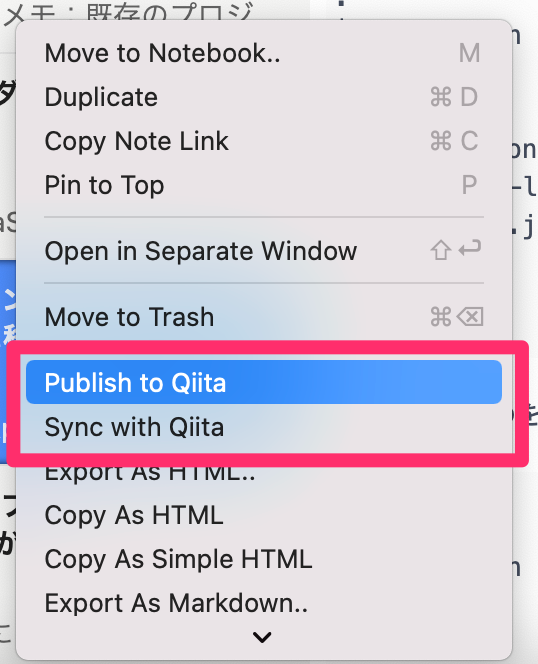
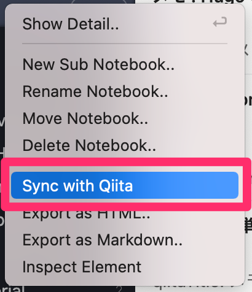

# Inkdrop Qiita Connect Plugin

> Inkdrop plugin that add menu to sync with Qiita

  

[日本語](https://github.com/Luke-1220/inkdrop-qiita-connect/blob/master/README-JP.md)

This is a Inkdrop plugin that add menu to publish and sync, with [Qiita API v2](https://qiita.com/api/v2/docs).

Some codes of this plugin are from [goldsziggy/inkdrop-plugin-blog-publish](https://github.com/goldsziggy/inkdrop-plugin-blog-publish).

## Install

```shell
ipm install qiita-connect
```

## Usage

| Item List | Notebook List |
| --- | --- |
|  |  |

### Publish an item to Qiita

You can publish an item to Qiita by right-clicking on item list.

### Sync an item with Qiita

You can sync an item with Qiita by right-clicking on item list.

> :warning: When synced, the content edited in Inkdrop will be overwritten.

### Sync items in a notebook with Qiita

You can add all the articles you have published to Qiita in your notebook by right-clicking on item list.

## Front Matter

```yaml
---
qiitaId: abcdefghijklmnopqrst
tags:
  - inkdrop
  - plugin
---
```

This plugin reads variables from Front Matter of top of articles, which is configured with yaml syntax.

### Variables

| Key | Type | Default Value | Required |  Limit | Description |
| --- | --- | --- | --- |  --- | --- |
| qiitaId | string | | [(Yes)](https://github.com/Luke-1220/inkdrop-qiita-connect#tips) | | Unique ID of the post (generated by plugin) |
| tags | [string] | | Yes |  | List of tags attached to the post |
| gist | boolean | `false` |  |  | Whether to post the code in the text to Gist or not (only available if GitHub integration is enabled) |
| tweet | boolean | `false` |  |  | Whether to post to Twitter or not (only available if Twitter integration is enabled) |
| coediting | boolean | `false` |  | Team Only | Whether to be in co-editing status or not. |
| groupUrlName | string |  |  | Team Only | The url_name of the group to which this post will be published (null to publish to all.) |
| private | boolean | `false` |  | Individual Only | Flag indicating whether the state is limited sharing or not. |

> :warning: You can't publish or sync private articles, because Qiita API does not support this.<br>If metadata contains `private: true`, an error will be displayed.

## Tips

This plugin will overwrite the article with the ID set in `qiitaId`, or the article with the same title if it is found, or post it as a new article if it is not found.

Since ID matching is the highest priority, if `qiitaId` is set, it will overwrite the article.

## Settings

Preferences -> Plugins -> qiita-connect -> Settings

Before using this plugin, you need to set up an access token.

You can get the token associated with your account from [here](https://qiita.com/settings/applications).

| Title | Default Value | Description |
| ---- | ---- | ---- |
| Qiita Access Token |  | Enter your access token. |
| Qiita Team Access Token |  | Enter your team's access token. |
| Mode | Individual | Select the token to use. |

## Changelogs

### 1.0.0 - First Release
* Every feature added
* Every bug fixed
